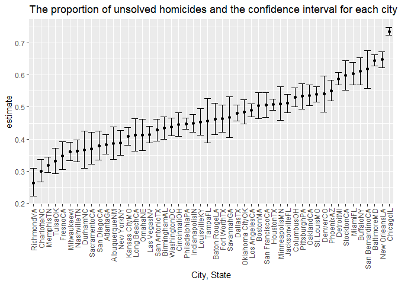

p8105\_hw5\_yl4923
================
Yujia Li
11/19/2021

## Problem 0

# create my public Github repo and local R with a single .Rmd file that renders to github\_document

# create a sub-directory to store the local data files used in the assignment, and use relative paths to access these data files

## Problem 1

``` r
# 1.1 Create a city_state variable and describe raw data
homi_df = 
  read_csv("./data/homicide-data.csv",na = c("","Unknown")) %>% 
  mutate(
    city_state = str_c(city, state),
    resolution = case_when(
      disposition == "Closed without arrest" ~ "unsolved",
      disposition == "Open/No arrest" ~ "unsolved",
      disposition == "Closed by arrest" ~ "solved"
    )) %>%
  relocate(city_state) %>%
  filter(city_state != "TulsaAL")
```

    ## Rows: 52179 Columns: 12

    ## -- Column specification --------------------------------------------------------
    ## Delimiter: ","
    ## chr (8): uid, victim_last, victim_first, victim_race, victim_sex, city, stat...
    ## dbl (4): reported_date, victim_age, lat, lon

    ## 
    ## i Use `spec()` to retrieve the full column specification for this data.
    ## i Specify the column types or set `show_col_types = FALSE` to quiet this message.

The homicides data records 52178 accidents identified by 14 variables in
major cities during the past ten years. Key variables include victim
characteristics (name, age, sex, etc.), disposition, location
(city/state).

The total number of homicides and the number of unsolved homicides
within cities are summarized below:

``` r
homi_stat = 
  homi_df %>% 
  group_by(city_state) %>% 
  summarise(
    unsolved = sum(disposition %in% c("Closed without arrest", "Open/No arrest")), 
    total_number = n()
    )

knitr::kable(homi_stat)
```

| city\_state      | unsolved | total\_number |
|:-----------------|---------:|--------------:|
| AlbuquerqueNM    |      146 |           378 |
| AtlantaGA        |      373 |           973 |
| BaltimoreMD      |     1825 |          2827 |
| Baton RougeLA    |      196 |           424 |
| BirminghamAL     |      347 |           800 |
| BostonMA         |      310 |           614 |
| BuffaloNY        |      319 |           521 |
| CharlotteNC      |      206 |           687 |
| ChicagoIL        |     4073 |          5535 |
| CincinnatiOH     |      309 |           694 |
| ColumbusOH       |      575 |          1084 |
| DallasTX         |      754 |          1567 |
| DenverCO         |      169 |           312 |
| DetroitMI        |     1482 |          2519 |
| DurhamNC         |      101 |           276 |
| Fort WorthTX     |      255 |           549 |
| FresnoCA         |      169 |           487 |
| HoustonTX        |     1493 |          2942 |
| IndianapolisIN   |      594 |          1322 |
| JacksonvilleFL   |      597 |          1168 |
| Kansas CityMO    |      486 |          1190 |
| Las VegasNV      |      572 |          1381 |
| Long BeachCA     |      156 |           378 |
| Los AngelesCA    |     1106 |          2257 |
| LouisvilleKY     |      261 |           576 |
| MemphisTN        |      483 |          1514 |
| MiamiFL          |      450 |           744 |
| MilwaukeewI      |      403 |          1115 |
| MinneapolisMN    |      187 |           366 |
| NashvilleTN      |      278 |           767 |
| New OrleansLA    |      930 |          1434 |
| New YorkNY       |      243 |           627 |
| OaklandCA        |      508 |           947 |
| Oklahoma CityOK  |      326 |           672 |
| OmahaNE          |      169 |           409 |
| PhiladelphiaPA   |     1360 |          3037 |
| PhoenixAZ        |      504 |           914 |
| PittsburghPA     |      337 |           631 |
| RichmondVA       |      113 |           429 |
| SacramentoCA     |      139 |           376 |
| San AntonioTX    |      357 |           833 |
| San BernardinoCA |      170 |           275 |
| San DiegoCA      |      175 |           461 |
| San FranciscoCA  |      336 |           663 |
| SavannahGA       |      115 |           246 |
| St. LouisMO      |      905 |          1677 |
| StocktonCA       |      266 |           444 |
| TampaFL          |       95 |           208 |
| TulsaOK          |      193 |           583 |
| WashingtonDC     |      589 |          1345 |

``` r
# 1.2 prop.test function for Baltimore
baltimore_df = 
  homi_df %>%
  filter(city_state == "BaltimoreMD")

baltimore_summary = 
  baltimore_df %>% 
  summarize(
    unsolved = sum(resolution == "unsolved"),
    n = n())

baltimore_test = 
  prop.test(
    x = baltimore_summary %>% pull(unsolved),
    n = baltimore_summary %>% pull(n)
)

baltimore_test %>% 
  broom::tidy()
```

    ## # A tibble: 1 x 8
    ##   estimate statistic  p.value parameter conf.low conf.high method    alternative
    ##      <dbl>     <dbl>    <dbl>     <int>    <dbl>     <dbl> <chr>     <chr>      
    ## 1    0.646      239. 6.46e-54         1    0.628     0.663 1-sample~ two.sided

``` r
# 1.3 run `prop.test` for each of the cities by writing a function
prop_test_function = function(city_df) {
  city_summary = 
    city_df %>% 
    summarize(
      unsolved = sum(resolution == "unsolved"),
      n = n()
    )
  city_test = 
    prop.test(
      x = city_summary %>% pull(unsolved),
      n = city_summary %>% pull(n))
  
  return(city_test)
}

prop_test_function(baltimore_df) #use Baltimore test the function and then run across all cities
```

    ## 
    ##  1-sample proportions test with continuity correction
    ## 
    ## data:  city_summary %>% pull(unsolved) out of city_summary %>% pull(n), null probability 0.5
    ## X-squared = 239.01, df = 1, p-value < 2.2e-16
    ## alternative hypothesis: true p is not equal to 0.5
    ## 95 percent confidence interval:
    ##  0.6275625 0.6631599
    ## sample estimates:
    ##         p 
    ## 0.6455607

``` r
nested_df = 
  homi_df %>%
  nest(data = uid:resolution) %>%
  mutate(
    test_results = map(data, prop_test_function),
    tidy_results = map(test_results, broom::tidy)
  ) %>%
  select(city_state, tidy_results) %>%
  unnest(tidy_results) %>%
  select(city_state, estimate, starts_with("conf"))
```

``` r
# 1.4 Create a plot that shows the estimates and CIs for each city. Organize cities according to the proportion of unsolved homicides.
nested_df %>% 
  mutate(city_state = fct_reorder(city_state, estimate)) %>%
  ggplot(aes(x = city_state, y = estimate)) +
  geom_point() +
  geom_errorbar(aes(ymin = conf.low, ymax = conf.high)) +
  labs( title = "The proportion of unsolved homicides and the confidence interval for each city",
        x = "City, State") +
  theme(axis.text.x = element_text(angle = 90, vjust = 0.5, hjust = 1))
```

<!-- -->

## Problem 2 longtitude study

``` r
# 2.1 Read in and tidy data with new variables-arm,ID
exp_df = 
  tibble(file_name = list.files("./data/problem2data/", pattern = "*")) %>% 
  mutate(data = map(.x = str_c("./data/problem2data/", file_name, sep = ""), ~ read.csv(.x))) %>%
  separate(file_name, into = c("filename", "postfix"), sep = "\\.") %>% 
  select(-postfix) %>% 
  separate(filename, into = c("arm", "id"), sep = "_", remove = F) %>%
  unnest() %>% 
  gather(key = weeks, value = observation, week_1:week_8) %>% 
  separate(weeks, into = c("prefix", "weeks"), sep = "_") %>% 
  select(-prefix) %>%
  select(id, arm, weeks, observation) %>% 
  mutate(
    arm = factor(arm, levels = c("exp", "con")), 
    id = factor(id), 
    weeks = factor(weeks)
  ) 
```

    ## Warning: `cols` is now required when using unnest().
    ## Please use `cols = c(data)`

``` r
head(exp_df)
```

    ## # A tibble: 6 x 4
    ##   id    arm   weeks observation
    ##   <fct> <fct> <fct>       <dbl>
    ## 1 01    con   1            0.2 
    ## 2 02    con   1            1.13
    ## 3 03    con   1            1.77
    ## 4 04    con   1            1.04
    ## 5 05    con   1            0.47
    ## 6 06    con   1            2.37

``` r
# 2.2 Observations on each subject over time, and comment on differences between groups.
exp_df %>%
  ggplot(aes(x = weeks, y = observation, color = arm)) +
  geom_path(aes(group = id)) +
  geom_point(alpha = .5) + 
  labs(
    title = "Longitudinal study plot",
    x = "Time (week)",
    y = "Observed data"
  )
```

<!-- -->
**Comments:** In the beginning of the experiment, the longitudinal data
observed both in the control group and the experimental group are quite
similar, which is around 1.5. Following along, `exp` arm is generally
higher than observations in `con` arm. A t-test with *alternative
hypothesis*: true difference in means between group exp and group con is
greater than 0 can support the assumption about difference between arms.
Since **p.value = 2.6656652^{-18}** is smaller than a significant level
at 5%, we can conclude that the experimental arm and control arm are
significantly different from each other. So the experimental arm may
have a positive impact on the longitudinal data.

## Problem 3 iris dataset

``` r
set.seed(10)

iris_with_missing = 
  iris %>% 
  map_df(~replace(.x, sample(1:150, 20), NA)) %>%
  mutate(Species = as.character(Species)) %>% 
  janitor::clean_names()
```

``` r
# write a function(vector output+ for numeric variables,with the mean of non-missing values; for character variables, with "virginica"))

replace_missing = function(x) {
  
  if (is.numeric(x)) {
    x[is.na(x)] = mean(x, na.rm = TRUE)
  } else if (is.character(x)) {
    x[is.na(x)] = "virginica"
  } else {
    stop("Argument x should be numeric or character")
  }
  x
}

# apply to iris data
iris_complete = map_df(iris_with_missing, replace_missing)
iris_complete
```

    ## # A tibble: 150 x 5
    ##    sepal_length sepal_width petal_length petal_width species
    ##           <dbl>       <dbl>        <dbl>       <dbl> <chr>  
    ##  1         5.1          3.5         1.4         0.2  setosa 
    ##  2         4.9          3           1.4         0.2  setosa 
    ##  3         4.7          3.2         1.3         0.2  setosa 
    ##  4         4.6          3.1         1.5         1.19 setosa 
    ##  5         5            3.6         1.4         0.2  setosa 
    ##  6         5.4          3.9         1.7         0.4  setosa 
    ##  7         5.82         3.4         1.4         0.3  setosa 
    ##  8         5            3.4         1.5         0.2  setosa 
    ##  9         4.4          2.9         1.4         0.2  setosa 
    ## 10         4.9          3.1         3.77        0.1  setosa 
    ## # ... with 140 more rows
